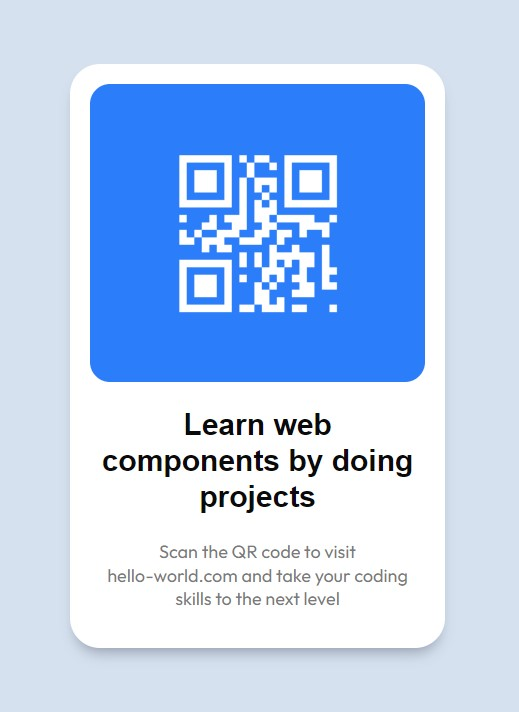

# Frontend Mentor - QR code component solution

This is a solution to the [QR code component challenge on Frontend Mentor](https://www.frontendmentor.io/challenges/qr-code-component-iux_sIO_H).

## Table of contents

- [Overview](#overview)
  - [Screenshot](#screenshot)
  - [Links](#links)
- [My process](#my-process)
  - [Built with](#built-with)
  - [What I learned](#what-i-learned)
- [Author](#author)

## Overview

### Screenshot



### Preview

- [Github Pages](https://your-live-site-url.com)

## My process

### Built with

- HTML5
- CSS: custom variables, flex, grid
- [Web components](https://developer.mozilla.org/en-US/docs/Web/API/Web_components)
- [Lit 2](https://lit.dev/) - JS library for web-components


### Web-components related stuff

#### Slots

This project helped me understand that `<slot>` is a nice declarative way of making web components more flexible. Slots can be thought of as placeholders in a component template that can be filled with any HTML fragment. It is a great means of **composition**.

Imagine a `<my-library>` web component. You can understand a `slot` as a bookshelf in the library with a corresponding label. Let's take a look at a bookshelf with a *fantasy* placeholder. It could be defined in our component as:


```js
// my-library.js

render() {
  <div class="library">
    <slot name="fantasy">
      // only fantasy books belong here
    </slot>
    <slot name="romance">
      // only romance books belong here
    </slot>
  </div>
}
```

Then you can place a proper book (HTML fragment) in the defined bookshelf slot in your HTML:

```html
<my-library>
  <p slot="fantasy">Way of Kings by Brandon Sanderson</p>
</my-library>
```

That's it. Corresponding `<p>` tag is rendered inside `<div class="library">` tag.


#### firstUpdated()

Once again, I realized that `firstUpdated()` is the best place to interact with a component's shadow DOM. I first tried to generate a QR canvas in the constructor method only to realize that the shadow DOM is not yet created.


### Useful resources

- [Using templates and slots by MDN](https://developer.mozilla.org/en-US/docs/Web/API/Web_components/Using_templates_and_slots)
- [Lit lifecycle](https://lit.dev/docs/components/lifecycle/)


## Acknowledgments

Thanks [frontendmentor.io](https://www.frontendmentor.io/) for this challenge!
